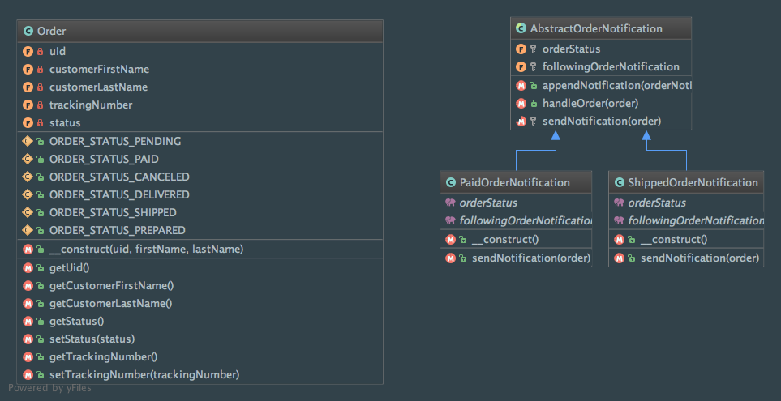

Chain of responsibility
=======================

Intent
------
According to the Gang of Four, the Chain of Responsibility pattern is a way to "avoid coupling the sender of a
request to its receiver by giving more than one object a chance to handle the request. Chain the receiving objects
and pass the request along the chain until an object handles it"
(Design Patterns: Elements of Reusable Object-Oriented Software, 2013, p. 223).

When to use it?
---------------
You should use the Chain of Responsibility pattern if multiple receivers are able to handle a request and if you
don't need to explicitly specify which receiver has to handle a given request (not known in advance and determined
automatically). Moreover, it allows you to keep senders and receivers decoupled.

Keep in mind that the chain doesn't ensure that a request will be handled before the end of the chain.

Diagram
-------
Created using PhpStorm and yFiles.

Implementation
--------------
Order.php

.. literalinclude:: ../../src/Behavioral/ChainOfResponsibility/Order.php
    :linenos:
    :language: php

AbstractOrderNotification.php

.. literalinclude:: ../../src/Behavioral/ChainOfResponsibility/AbstractOrderNotification.php
    :linenos:
    :language: php

PaidOrderNotification.php

.. literalinclude:: ../../src/Behavioral/ChainOfResponsibility/OrderNotification/PaidOrderNotification.php
    :linenos:
    :language: php

ShippedOrderNotification.php

.. literalinclude:: ../../src/Behavioral/ChainOfResponsibility/OrderNotification/ShippedOrderNotification.php
    :linenos:
    :language: php

Tests
-----
ChainOfResponsibilityTest.php

.. literalinclude:: ../../tests/Behavioral/ChainOfResponsibility/ChainOfResponsibilityTest.php
    :linenos:
    :language: php