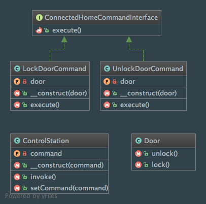

Command
=======

Intent
------
According to the Gang of Four, the Command pattern is a way to "encapsulate a request as an object,
thereby letting you parameterize clients with different requests, queue or log requests, and support undoable
operations"
(Design Patterns: Elements of Reusable Object-Oriented Software, 2013, p. 233).

When to use it?
---------------
First of all, the Command pattern will help you to decouple the Invoker from the object that is invoked and knows how
to perform an action (the Receiver).

It should be used when you need your application to parameterize objects by an action to perform (it's a way to
implement 'callbacks' in object-oriented programming) or if you have to develop a rollback mechanism (undo support).

The Command pattern also lets you queue and execute requests at different times.

Diagram
-------
Created using PhpStorm and yFiles.

Implementation
--------------
Door.php (the Receiver)

.. literalinclude:: ../../../src/Behavioral/Command/Door.php
    :linenos:
    :language: php

ConnectedHomeCommandInterface.php (the Command Interface)

.. literalinclude:: ../../../src/Behavioral/Command/ConnectedHomeCommandInterface.php
    :linenos:
    :language: php

LockDoorCommand.php (a concrete Command)

.. literalinclude:: ../../../src/Behavioral/Command/ConnectedHomeCommand/LockDoorCommand.php
    :linenos:
    :language: php

UnlockDoorCommand.php (another concrete Command)

.. literalinclude:: ../../../src/Behavioral/Command/ConnectedHomeCommand/UnlockDoorCommand.php
    :linenos:
    :language: php

ControlStation.php (the Invoker)

.. literalinclude:: ../../../src/Behavioral/Command/ControlStation.php
    :linenos:
    :language: php

Tests
-----
CommandTest.php

.. literalinclude:: ../../../tests/Behavioral/Command/CommandTest.php
    :linenos:
    :language: php