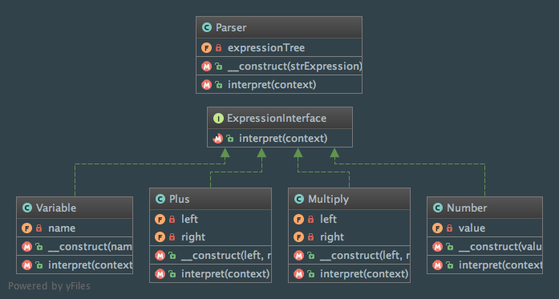

Interpreter
===========

Intent
------
According to the Gang of Four, the Interpreter pattern is defined like that: "Given a language, define a
representation for its grammar along with an interpreter that uses the representation to interpret sentences in the
language" (Design Patterns: Elements of Reusable Object-Oriented Software, 2013, p. 243).

When to use it?
---------------
The Interpreter pattern should be used when a language has to be interpreted. It is better if the grammar used is
pretty simple and if the efficiency is not a major concern.

Diagram
-------
Created using PhpStorm and yFiles.

Implementation
--------------
ExpressionInterface.php

.. literalinclude:: ../../src/Behavioral/Interpreter/ExpressionInterface.php
    :linenos:
    :language: php

Multiply.php

.. literalinclude:: ../../src/Behavioral/Interpreter/Expression/Multiply.php
    :linenos:
    :language: php

Plus.php

.. literalinclude:: ../../src/Behavioral/Interpreter/Expression/Plus.php
    :linenos:
    :language: php

Number.php

.. literalinclude:: ../../src/Behavioral/Interpreter/Expression/Number.php
    :linenos:
    :language: php

Variable.php

.. literalinclude:: ../../src/Behavioral/Interpreter/Expression/Variable.php
    :linenos:
    :language: php

Parser.php

.. literalinclude:: ../../src/Behavioral/Interpreter/Parser.php
    :linenos:
    :language: php

Tests
-----
InterpreterTest.php

.. literalinclude:: ../../tests/Behavioral/Interpreter/InterpreterTest.php
    :linenos:
    :language: php