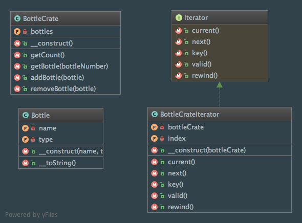
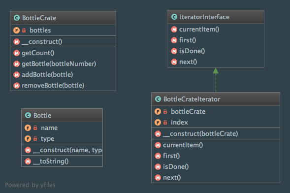

Iterator
========

Intent
------
According to the Gang of Four, the Iterator pattern aims to "provide a way to access the elements of an aggregate
object sequentially without exposing its underlying representation"
(Design Patterns: Elements of Reusable Object-Oriented Software, 2013, p. 257).

When to use it?
---------------
The Iterator pattern should be used in various cases:

  - you need to have access to an element of a collection without exposing the internal structure of that collection
  - your application needs to support multiple simultaneous traversals of a collection.
  - you want to provide a uniform interface for traversing different types of collections

Diagram
-------
Created using PhpStorm and yFiles.

Using Standard PHP Library (SPL)
________________________________

Without Standard PHP Library (SPL)
__________________________________

Implementation
--------------
Bottle.php

.. literalinclude:: ../../src/Behavioral/Iterator/Bottle.php
    :linenos:
    :language: php

BottleCrate.php

.. literalinclude:: ../../src/Behavioral/Iterator/BottleCrate.php
    :linenos:
    :language: php

Using Standard PHP Library (SPL)
________________________________
BottleCrateIterator.php

.. literalinclude:: ../../src/Behavioral/Iterator/UsingSPL/BottleCrateIterator.php
    :linenos:
    :language: php

Without Standard PHP Library (SPL)
__________________________________
IteratorInterface.php

.. literalinclude:: ../../src/Behavioral/Iterator/WithoutSPL/IteratorInterface.php
    :linenos:
    :language: php

BottleCrateIterator.php

.. literalinclude:: ../../src/Behavioral/Iterator/WithoutSPL/BottleCrateIterator.php
    :linenos:
    :language: php

Tests
-----
BottleCrateTest.php

.. literalinclude:: ../../tests/Behavioral/Iterator/BottleCrateTest.php
    :linenos:
    :language: php

Using Standard PHP Library (SPL)
________________________________
IteratorTest.php

.. literalinclude:: ../../tests/Behavioral/Iterator/UsingSPL/IteratorTest.php
    :linenos:
    :language: php

Without Standard PHP Library (SPL)
__________________________________
IteratorTest.php

.. literalinclude:: ../../tests/Behavioral/Iterator/WithoutSPL/IteratorTest.php
    :linenos:
    :language: php