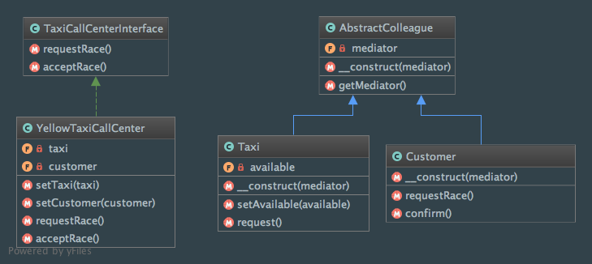

Mediator
========

Intent
------
According to the Gang of Four, the Mediator is a way to "define an object that encapsulates how a set of objects
interact. Mediator promotes loose coupling by keeping objects from referring to each other explicitly, and it lets
you vary their interaction independently"
(Design Patterns: Elements of Reusable Object-Oriented Software, 2013, p. 273).

When to use it?
---------------
Mediator pattern should be used when a large set of objects has too many direct relationships and you want to reduce
that complexity. It's a way to balance distribution of behavior among objects with loose coupling.

Diagram
-------
Created using PhpStorm and yFiles.

Implementation
--------------
AbstractColleague.php

.. literalinclude:: ../../../src/Behavioral/Mediator/AbstractColleague.php
    :linenos:
    :language: php

Customer.php

.. literalinclude:: ../../../src/Behavioral/Mediator/Colleague/Customer.php
    :linenos:
    :language: php

Taxi.php

.. literalinclude:: ../../../src/Behavioral/Mediator/Colleague/Taxi.php
    :linenos:
    :language: php

TaxiCallCenterInterface.php

.. literalinclude:: ../../../src/Behavioral/Mediator/TaxiCallCenterInterface.php
    :linenos:
    :language: php

YellowTaxiCallCenter.php

.. literalinclude:: ../../../src/Behavioral/Mediator/TaxiCallCenter/YellowTaxiCallCenter.php
    :linenos:
    :language: php

Tests
-----
MediatorTest.php

.. literalinclude:: ../../../tests/Behavioral/Mediator/MediatorTest.php
    :linenos:
    :language: php