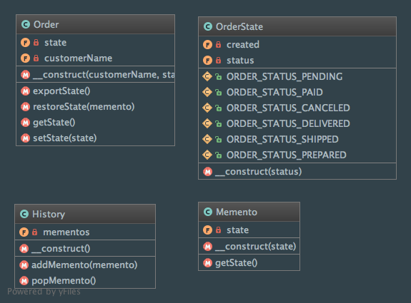

Memento
=======

Intent
------
According to the Gang of Four, the Memento pattern is defined like that: "Without violating encapsulation, capture and
externalize an object's internal state so that the object can be restored to this state later"
(Design Patterns: Elements of Reusable Object-Oriented Software, 2013, p. 283).

When to use it?
---------------
Memento pattern should be used to implement undo / redo mechanisms (you save a snapshot of an object's state and you
restore or not that state later).

Diagram
-------
Created using PhpStorm and yFiles.

Implementation
--------------
Order.php

.. literalinclude:: ../../src/Behavioral/Memento/Order.php
    :linenos:
    :language: php

OrderState.php

.. literalinclude:: ../../src/Behavioral/Memento/OrderState.php
    :linenos:
    :language: php

Memento.php

.. literalinclude:: ../../src/Behavioral/Memento/Memento.php
    :linenos:
    :language: php

History.php

.. literalinclude:: ../../src/Behavioral/Memento/History.php
    :linenos:
    :language: php

Tests
-----
MementoTest.php

.. literalinclude:: ../../tests/Behavioral/Memento/MementoTest.php
    :linenos:
    :language: php