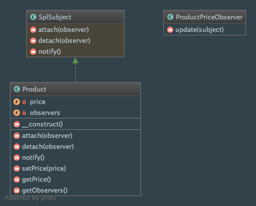
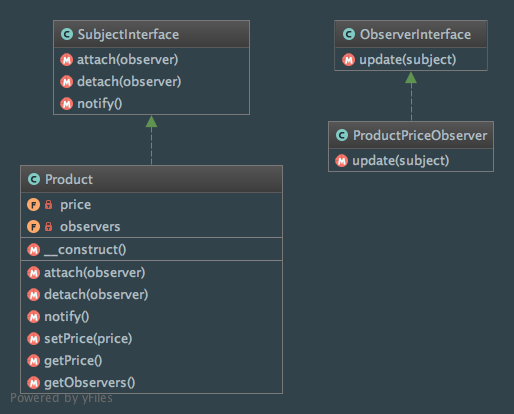

Observer
========

Intent
------
According to the Gang of Four, the Observer pattern defines "a one-to-many dependency between objects so that when
one object [the subject] changes state, all its dependents [the observers] are notified and updated automatically"
(Design Patterns: Elements of Reusable Object-Oriented Software, 2013, p. 293).

Traditionally observers will be notified by calling one of their methods (like update() in the examples below). To
illustrate it, I have decided to write code where observers want to monitor products' prices. Each time the price
evolves, the observers will be notified!

When to use it?
---------------
The Observer pattern allows you to apply the `Open Closed Principle (OCP)
<https://en.wikipedia.org/wiki/Open/closed_principle>`_ which states that you should be able to extend classes
without modifying them (thanks to `Bertrand Meyer <https://en.wikipedia.org/wiki/Bertrand_Meyer>`_ for that principle).

Indeed you can register an unlimited number of observers without the need to change the class of the Subject
(you may simply don't have any idea of how many Observers objects will be linked to the Subject).

In a nutshell, you should use the Observer pattern when you don't want your objects to be tightly coupled
(here, only one class, the Observer, is directly aware about the existence of the subject).

Diagram
-------
Created using PhpStorm and yFiles.

Using Standard PHP Library (SPL)
________________________________

Without Standard PHP Library (SPL)
__________________________________

Implementation
--------------
Using Standard PHP Library (SPL)
________________________________
Product.php

.. literalinclude:: ../../../src/Behavioral/Observer/UsingSPL/Product.php
    :linenos:
    :language: php

ProductPriceObserver.php

.. literalinclude:: ../../../src/Behavioral/Observer/UsingSPL/ProductPriceObserver.php
    :linenos:
    :language: php

Without Standard PHP Library (SPL)
__________________________________
SubjectInterface.php

.. literalinclude:: ../../../src/Behavioral/Observer/WithoutSPL/SubjectInterface.php
    :linenos:
    :language: php

ObserverInterface.php

.. literalinclude:: ../../../src/Behavioral/Observer/WithoutSPL/ObserverInterface.php
    :linenos:
    :language: php

Product.php

.. literalinclude:: ../../../src/Behavioral/Observer/WithoutSPL/Product.php
    :linenos:
    :language: php

ProductPriceObserver.php

.. literalinclude:: ../../../src/Behavioral/Observer/WithoutSPL/ProductPriceObserver.php
    :linenos:
    :language: php

Tests
-----
Using Standard PHP Library (SPL)
________________________________
ProductTest.php

.. literalinclude:: ../../../tests/Behavioral/Observer/UsingSPL/ProductTest.php
    :linenos:
    :language: php

ProductPriceObserverTest.php

.. literalinclude:: ../../../tests/Behavioral/Observer/UsingSPL/ProductPriceObserverTest.php
    :linenos:
    :language: php

Without Standard PHP Library (SPL)
__________________________________
ProductTest.php

.. literalinclude:: ../../../tests/Behavioral/Observer/WithoutSPL/ProductTest.php
    :linenos:
    :language: php

ProductPriceObserverTest.php

.. literalinclude:: ../../../tests/Behavioral/Observer/WithoutSPL/ProductPriceObserverTest.php
    :linenos:
    :language: php