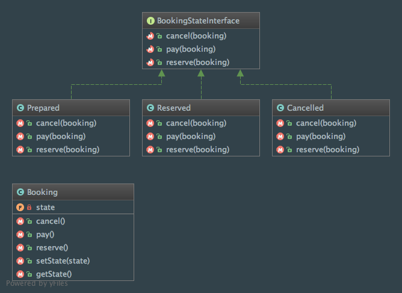

State
=====

Intent
------

According to the Gang of Four, the State pattern is a way to "allow an object to alter its behavior when its internal
state changes. The object will appear to change its class."
(Design Patterns: Elements of Reusable Object-Oriented Software, 2013, p. 305).

When to use it?
---------------
The State pattern should be used in mainly two different cases:

  - the behavior of an object depends on its state, and the behavior have to change dynamically (according to the state)
  - lots of conditional structures are used to handle what to do depending on the state of the object

Diagram
-------
Created using PhpStorm and yFiles.

Implementation
--------------
BookingStateInterface.php

.. literalinclude:: ../../src/Behavioral/State/BookingStateInterface.php
    :linenos:
    :language: php

Cancelled.php

.. literalinclude:: ../../src/Behavioral/State/BookingState/Cancelled.php
    :linenos:
    :language: php

Prepared.php

.. literalinclude:: ../../src/Behavioral/State/BookingState/Prepared.php
    :linenos:
    :language: php

Reserved.php

.. literalinclude:: ../../src/Behavioral/State/BookingState/Reserved.php
    :linenos:
    :language: php

Booking.php

.. literalinclude:: ../../src/Behavioral/State/Booking.php
    :linenos:
    :language: php

Tests
-----
StateTest.php

.. literalinclude:: ../../tests/Behavioral/State/StateTest.php
    :linenos:
    :language: php