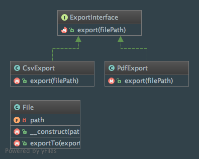

Strategy
========

Intent
------
According to the Gang of Four, the Strategy pattern is a way to "define a family of algorithms, encapsulate each one,
and make them interchangeable. Strategy lets the algorithm vary independently from clients that use it"
(Design Patterns: Elements of Reusable Object-Oriented Software, 2013, p. 315).

When to use it?
---------------
The Strategy pattern should be used in various cases:

  - several classes differ only in their behavior (Strategy pattern lets you "attach" a behavior to a class)
  - different variants of an algorithm are needed
  - algorithms deal with data that should be hidden from the client

Diagram
-------
Created using PhpStorm and yFiles.

Implementation
--------------
ExportInterface.php

.. literalinclude:: ../../src/Behavioral/Strategy/ExportInterface.php
    :linenos:
    :language: php

CsvExport.php

.. literalinclude:: ../../src/Behavioral/Strategy/Export/CsvExport.php
    :linenos:
    :language: php

PdfExport.php

.. literalinclude:: ../../src/Behavioral/Strategy/Export/PdfExport.php
    :linenos:
    :language: php

File.php

.. literalinclude:: ../../src/Behavioral/Strategy/File.php
    :linenos:
    :language: php

Tests
-----
StrategyTest.php

.. literalinclude:: ../../tests/Behavioral/Strategy/StrategyTest.php
    :linenos:
    :language: php