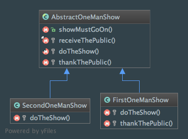

Template Method
===============

Intent
------
According to the Gang of Four, the Template Method pattern is a way to "define the skeleton of an algorithm in an
operation, deferring some steps to subclasses. Template Method lets subclasses redefine certain steps of an algorithm
without changing the algorithm's structure"
(Design Patterns: Elements of Reusable Object-Oriented Software, 2013, p.325).

As stated in the book, the Template Method pattern leads to an example of `inversion of control (IoC)
<https://en.wikipedia.org/wiki/Inversion_of_control>`_ principle which is sometimes referred to as the `Hollywood
Principle: don't call us, we'll call you <https://en.wikipedia.org/wiki/Hollywood_principle>`_.

When to use it?
---------------
The Template Method pattern should be used in various cases:

  - you want to implement the invariant parts of a algorithm and give subclasses the ability to customize varying parts
    using method overriding
  - you are concerned about code duplication and you want to avoid it (see first bullet)
  - you have to control inheritance and how it is performed. Just the varying part of a method will be rewritten (it
    will not be entirely rewritten)

Diagram
-------
Created using PhpStorm and yFiles.

Implementation
--------------
AbstractOneManShow.php

.. literalinclude:: ../../src/Behavioral/TemplateMethod/AbstractOneManShow.php
    :linenos:
    :language: php

FirstOneManShow.php

.. literalinclude:: ../../src/Behavioral/TemplateMethod/OneManShow/FirstOneManShow.php
    :linenos:
    :language: php

SecondOneManShow.php

.. literalinclude:: ../../src/Behavioral/TemplateMethod/OneManShow/SecondOneManShow.php
    :linenos:
    :language: php

Tests
-----
TemplateMethodTest.php

.. literalinclude:: ../../tests/Behavioral/TemplateMethod/TemplateMethodTest.php
    :linenos:
    :language: php