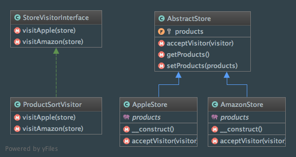

Visitor
=======

Intent
------
According to the Gang of Four, the Visitor pattern is a way to "represent an operation to be performed on the
elements of an object structure. Visitor lets you define a new operation without changing the classes of the elements
on which it operates" (Design Patterns: Elements of Reusable Object-Oriented Software, 2013, p. 331).

The Visitor Pattern requires the ability to determine (dynamically) the type of the Visitor and the type of the
visited object to be able to find which operation to execute. To do that, it implements the
`double dispatch <https://en.wikipedia.org/wiki/Double_dispatch>`_ mechanism.

When to use it?
---------------
The Visitor pattern should be used in various cases:

  - an object structure contains different classes with different interfaces and you want to perform operations
    depending on their concrete classes.
  - you want to perform distinct and unrelated operations on objects without polluting their concrete classes.
  - the object structure will not change and you want to easily add new operations. Just add new Visitors and let the
    object structure unchanged.

Diagram
-------
Created using PhpStorm and yFiles.

Implementation
--------------
StoreVisitorInterface.php

.. literalinclude:: ../../src/Behavioral/Visitor/StoreVisitorInterface.php
    :linenos:
    :language: php

ProductSortVisitor.php

.. literalinclude:: ../../src/Behavioral/Visitor/StoreVisitor/ProductSortVisitor.php
    :linenos:
    :language: php

AbstractStore.php

.. literalinclude:: ../../src/Behavioral/Visitor/AbstractStore.php
    :linenos:
    :language: php

AmazonStore.php

.. literalinclude:: ../../src/Behavioral/Visitor/Store/AmazonStore.php
    :linenos:
    :language: php

AppleStore.php

.. literalinclude:: ../../src/Behavioral/Visitor/Store/AppleStore.php
    :linenos:
    :language: php

Tests
-----
VisitorTest.php

.. literalinclude:: ../../tests/Behavioral/Visitor/VisitorTest.php
    :linenos:
    :language: php