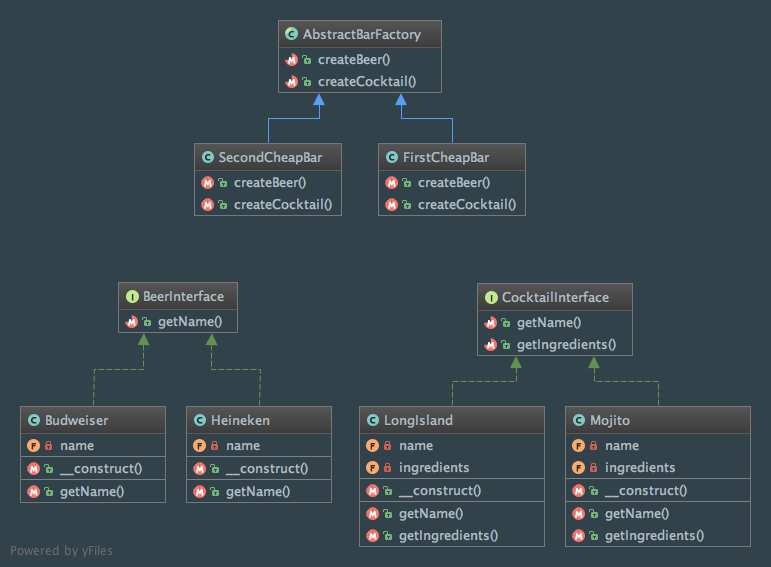

Abstract Factory
================

Intent
------
According to the Gang of Four, the Abstract Factory pattern "provide an interface for creating families of related or
dependent objects without specifying their concrete classes" (Design Patterns: Elements of Reusable Object-Oriented
Software, 2013, p. 87).

When to use it?
---------------
The Abstract Factory pattern should be used when :

 - an application has to be independent from the way objects are created
 - you need to deal with families of objects and you wand to easily switch from one to another
 - families of products were designed to work together only

Abstract Factory pattern is a very central design pattern for Dependency Injection (DI).

Diagram
-------
Created using PhpStorm and yFiles.

Implementation
--------------
BeerInterface.php

.. literalinclude:: ../../src/Creational/AbstractFactory/BeerInterface.php
    :linenos:
    :language: php

Budweiser.php

.. literalinclude:: ../../src/Creational/AbstractFactory/Beer/Budweiser.php
    :linenos:
    :language: php

Heineken.php

.. literalinclude:: ../../src/Creational/AbstractFactory/Beer/Heineken.php
    :linenos:
    :language: php

CocktailInterface.php

.. literalinclude:: ../../src/Creational/AbstractFactory/CocktailInterface.php
    :linenos:
    :language: php

LongIsland.php

.. literalinclude:: ../../src/Creational/AbstractFactory/Cocktail/LongIsland.php
    :linenos:
    :language: php

Mojito.php

.. literalinclude:: ../../src/Creational/AbstractFactory/Cocktail/Mojito.php
    :linenos:
    :language: php

AbstractBarFactory.php

.. literalinclude:: ../../src/Creational/AbstractFactory/AbstractBarFactory.php
    :linenos:
    :language: php

FirstCheapBar.php

.. literalinclude:: ../../src/Creational/AbstractFactory/Bar/FirstCheapBar.php
    :linenos:
    :language: php

SecondCheapBar.php

.. literalinclude:: ../../src/Creational/AbstractFactory/Bar/SecondCheapBar.php
    :linenos:
    :language: php

Tests
-----
AbstractBarFactoryTest.php

.. literalinclude:: ../../tests/Creational/AbstractFactory/AbstractBarFactoryTest.php
    :linenos:
    :language: php