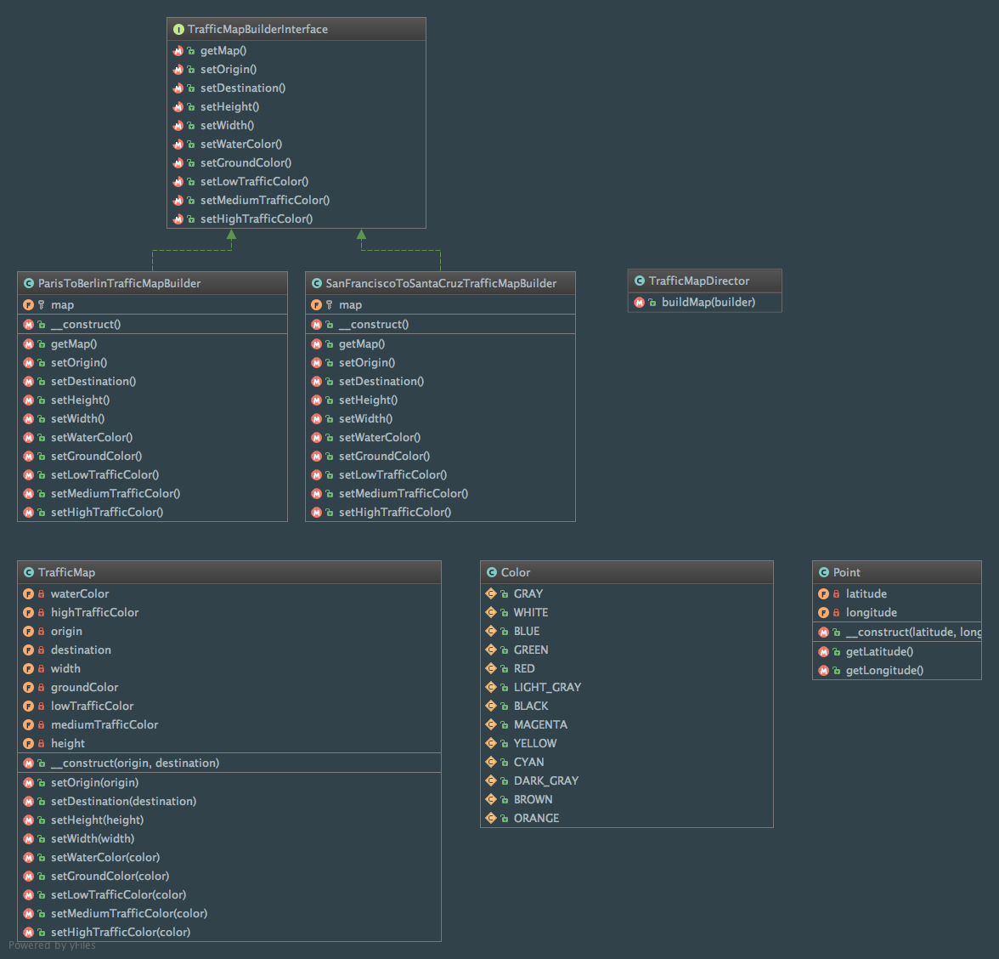

Builder
=======

Intent
------
According to the Gang of Four, the Builder pattern is a way to "separate the construction of a complex object from
its representation so that the same construction process can create different representations"
(Design Patterns: Elements of Reusable Object-Oriented Software, 2013, p. 97).

The construction process is controlled by a Director object and uses a step by step approach.

When to use it?
---------------
The Builder pattern should be used to create complex objects with lots of things to do to instantiate them. It
permits to maintain creation algorithms decoupled from the rest of the code so that you can add objects' representations
without affecting the rest.

The Builder pattern focuses on creating complex objects in a step by step manner while the Abstract Factory pattern
puts its emphasis on products' families.

Diagram
-------
Created using PhpStorm and yFiles.

Implementation
--------------
TrafficMap.php

.. literalinclude:: ../../src/Creational/Builder/TrafficMap/TrafficMap.php
    :linenos:
    :language: php

Point.php

.. literalinclude:: ../../src/Creational/Builder/TrafficMap/Point.php
    :linenos:
    :language: php

Color.php

.. literalinclude:: ../../src/Creational/Builder/TrafficMap/Color.php
    :linenos:
    :language: php

TrafficMapBuilderInterface.php

.. literalinclude:: ../../src/Creational/Builder/TrafficMapBuilderInterface.php
    :linenos:
    :language: php

ParisToBerlinTrafficMapBuilder.php

.. literalinclude:: ../../src/Creational/Builder/ConcreteBuilder/ParisToBerlinTrafficMapBuilder.php
    :linenos:
    :language: php

SanFranciscoToSantaCruzTrafficMapBuilder.php

.. literalinclude:: ../../src/Creational/Builder/ConcreteBuilder/SanFranciscoToSantaCruzTrafficMapBuilder.php
    :linenos:
    :language: php

TrafficMapDirector.php

.. literalinclude:: ../../src/Creational/Builder/TrafficMapDirector.php
    :linenos:
    :language: php

Tests
-----
TrafficMapDirectorTest.php

.. literalinclude:: ../../tests/Creational/Builder/TrafficMapDirectorTest.php
    :linenos:
    :language: php