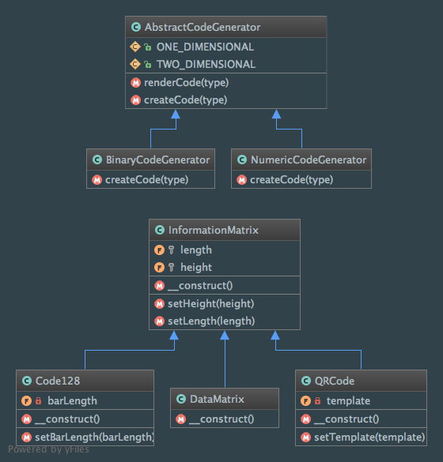

Factory Method
==============

Intent
------
According to the Gang of Four, the Factory Method pattern is a way to "define an interface for creating an object,
but let subclasses decide which class to instantiate. Factory Method lets a class defer instantiation to subclasses"
(Design Patterns: Elements of Reusable Object-Oriented Software, 2013, p. 107).

When to use it?
---------------
The Factory Method pattern should be used to avoid coupling between client and objects creation or if you don't know
in advance all the concrete classes to instantiate.

Diagram
-------
Created using PhpStorm and yFiles.

Implementation
--------------
InformationMatrix.php

.. literalinclude:: ../../../src/Creational/FactoryMethod/InformationMatrix.php
    :linenos:
    :language: php

Code128.php (a special type of barcode)

.. literalinclude:: ../../../src/Creational/FactoryMethod/Matrix/Code128.php
    :linenos:
    :language: php

DataMatrix.php

.. literalinclude:: ../../../src/Creational/FactoryMethod/Matrix/DataMatrix.php
    :linenos:
    :language: php

QRCode.php

.. literalinclude:: ../../../src/Creational/FactoryMethod/Matrix/QRCode.php
    :linenos:
    :language: php

AbstractCodeGenerator.php

.. literalinclude:: ../../../src/Creational/FactoryMethod/AbstractCodeGenerator.php
    :linenos:
    :language: php

BinaryCodeGenerator.php

.. literalinclude:: ../../../src/Creational/FactoryMethod/Generator/BinaryCodeGenerator.php
    :linenos:
    :language: php

NumericCodeGenerator.php

.. literalinclude:: ../../../src/Creational/FactoryMethod/Generator/NumericCodeGenerator.php
    :linenos:
    :language: php

Tests
-----
CodeGeneratorTest.php

.. literalinclude:: ../../../tests/Creational/FactoryMethod/CodeGeneratorTest.php
    :linenos:
    :language: php