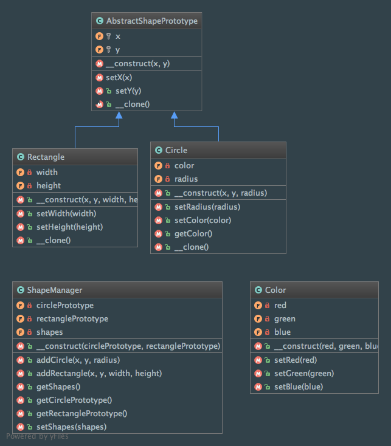

Prototype
=========

Intent
------
According to the Gang of Four, the Prototype pattern is a way to "specify the kinds of objects to create using a
prototypical instance, and create new objects by copying this prototype"
(Design Patterns: Elements of Reusable Object-Oriented Software, 2013, p. 117).

The pattern is quite simple. First, the Prototype interface declares a method for cloning itself and then the
concrete Prototype will implement the method for cloning itself.

When to use it?
---------------
The Prototype pattern should be used when creating an instance of a class is expensive or complicated and you want to
hide that complexity from the client

Diagram
-------
Created using PhpStorm and yFiles.

Implementation
--------------
AbstractShapePrototype.php

.. literalinclude:: ../../../src/Creational/Prototype/AbstractShapePrototype.php
    :linenos:
    :language: php

Circle.php

.. literalinclude:: ../../../src/Creational/Prototype/Shape/Circle.php
    :linenos:
    :language: php

Rectangle.php

.. literalinclude:: ../../../src/Creational/Prototype/Shape/Rectangle.php
    :linenos:
    :language: php

Color.php

.. literalinclude:: ../../../src/Creational/Prototype/Color.php
    :linenos:
    :language: php

ShapeManager.php

.. literalinclude:: ../../../src/Creational/Prototype/ShapeManager.php
    :linenos:
    :language: php

Tests
-----
ShapePrototypeTest.php

.. literalinclude:: ../../../tests/Creational/Prototype/ShapePrototypeTest.php
    :linenos:
    :language: php