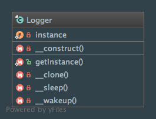

Singleton
=========

Intent
------
The purpose of the Singleton pattern is to ensure that a class will only have one instance at any time during code
execution. Another key feature is to provide a global access to that instance.

When to use it?
---------------
For many people (including myself), Singleton is the political and nice name for global variables on object-oriented
programming and that is the main drawback (global access + global state).

Global access makes source code hard to test ! Indeed, each objects should declare its collaborators in the
constructor (dependency injection) in order to be able to mock dependencies.

For more details, I suggest you the great Miško Hevery's blog (`The Testability Explorer <http://misko.hevery.com>`_)
and especially these posts:

- `Singletons are Pathological Liars <http://misko.hevery.com/2008/08/17/singletons-are-pathological-liars>`_
- `Root Cause of Singletons <http://misko.hevery.com/2008/08/25/root-cause-of-singletons>`_

Having said this, a few Singletons may be used inside your application without "harming" it. All objects that do not
affect the behavior of your application (like a Logger) may be perfect examples.

Diagram
-------
Created using PhpStorm and yFiles.

Implementation
--------------
Logger.php

.. literalinclude:: ../../src/Creational/Singleton/Logger.php
   :linenos:
   :language: php

Tests
-----
LoggerTest.php

.. literalinclude:: ../../tests/Creational/Singleton/LoggerTest.php
   :linenos:
   :language: php
