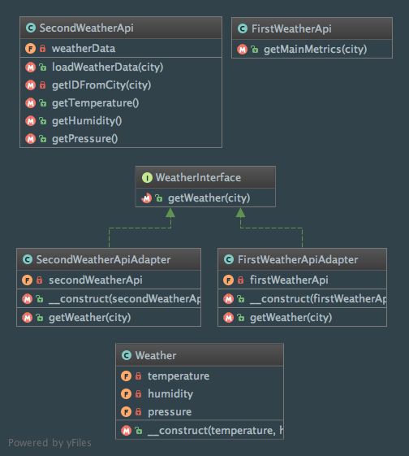

Adapter
=======

Intent
------
According to the Gang of Four, the Adapter pattern is a way to "convert the interface of a class into another
interface clients expect. Adapter lets classes work together that couldn't otherwise because of incompatible
interfaces."
(Design Patterns: Elements of Reusable Object-Oriented Software, 2013, p. 139).

When to use it?
---------------
Use the Adapter pattern if you are are concerned about the integration of incompatible components / libraries, or if
you face an existing class that doesn't match the interface you need.

Note that the pattern also allows to decouple the client code from the adaptee implementations.

Diagram
-------
Created using PhpStorm and yFiles.

Implementation
--------------
FirstWeatherApi.php

.. literalinclude:: ../../src/Structural/Adapter/FirstWeatherApi/FirstWeatherApi.php
    :linenos:
    :language: php

SecondWeatherApi.php

.. literalinclude:: ../../src/Structural/Adapter/SecondWeatherApi/SecondWeatherApi.php
    :linenos:
    :language: php

WeatherInterface.php

.. literalinclude:: ../../src/Structural/Adapter/WeatherInterface.php
    :linenos:
    :language: php

FirstWeatherApiAdapter.php

.. literalinclude:: ../../src/Structural/Adapter/FirstWeatherApi/FirstWeatherApiAdapter.php
    :linenos:
    :language: php

SecondWeatherApiAdapter.php

.. literalinclude:: ../../src/Structural/Adapter/SecondWeatherApi/SecondWeatherApiAdapter.php
    :linenos:
    :language: php

Weather.php

.. literalinclude:: ../../src/Structural/Adapter/Weather.php
    :linenos:
    :language: php

Tests
-----
AdapterTest.php

.. literalinclude:: ../../tests/Structural/Adapter/AdapterTest.php
    :linenos:
    :language: php