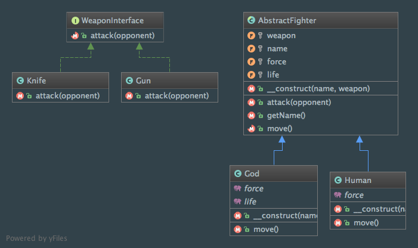

Bridge
======

Intent
------
According to the Gang of Four, the Bridge pattern is a way to "decouple an abstraction from its implementation so
that the two can vary independently"
(Design Patterns: Elements of Reusable Object-Oriented Software, 2013, p. 151).

When to use it?
---------------
The Bridge pattern is similar to the Adapter pattern but its underlying motivation is significantly different. The
Adapter pattern will create an interface for unrelated classes to work together (these classes aren't supposed to be
aware of each other) while the Bridge pattern should be thought as soon as possible during the design level, before
having knowledge of future involved classes, to separate the interface from implementation!

Diagram
-------
Created using PhpStorm and yFiles.

Implementation
--------------
AbstractFighter.php

.. literalinclude:: ../../src/Structural/Bridge/AbstractFighter.php
    :linenos:
    :language: php

God.php

.. literalinclude:: ../../src/Structural/Bridge/Fighter/God.php
    :linenos:
    :language: php

Human.php

.. literalinclude:: ../../src/Structural/Bridge/Fighter/Human.php
    :linenos:
    :language: php

WeaponInterface.php

.. literalinclude:: ../../src/Structural/Bridge/WeaponInterface.php
    :linenos:
    :language: php

Gun.php

.. literalinclude:: ../../src/Structural/Bridge/Weapon/Gun.php
    :linenos:
    :language: php

Knife.php

.. literalinclude:: ../../src/Structural/Bridge/Weapon/Knife.php
    :linenos:
    :language: php

Tests
-----
BridgeTest.php

.. literalinclude:: ../../tests/Structural/Bridge/BridgeTest.php
    :linenos:
    :language: php