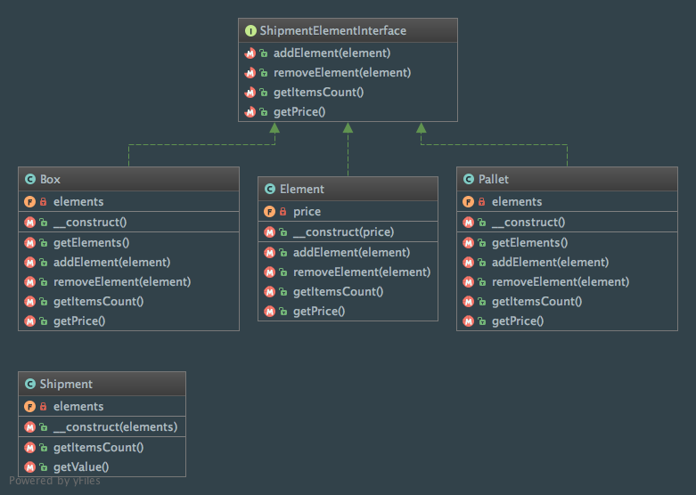

Composite
=========

Intent
------
According to the Gang of Four, the Composite pattern is a way to "compose objects into tree structures to represent
part-whole hierarchies. Composite lets clients treat individual objects and compositions of objects uniformly"
(Design Patterns: Elements of Reusable Object-Oriented Software, 2013, p. 163).

When to use it?
---------------
The composite pattern should be used when you don't want to expose the difference between compositions of objects and
individual objects.

Diagram
-------
Created using PhpStorm and yFiles.

Implementation
--------------
ShipmentElementInterface.php

.. literalinclude:: ../../src/Structural/Composite/ShipmentElementInterface.php
    :linenos:
    :language: php

Element.php

.. literalinclude:: ../../src/Structural/Composite/ShipmentElement/Element.php
    :linenos:
    :language: php

Box.php

.. literalinclude:: ../../src/Structural/Composite/ShipmentElement/Box.php
    :linenos:
    :language: php

Pallet.php

.. literalinclude:: ../../src/Structural/Composite/ShipmentElement/Pallet.php
    :linenos:
    :language: php

Shipment.php

.. literalinclude:: ../../src/Structural/Composite/Shipment.php
    :linenos:
    :language: php

Tests
-----
CompositeTest.php

.. literalinclude:: ../../tests/Structural/Composite/CompositeTest.php
    :linenos:
    :language: php