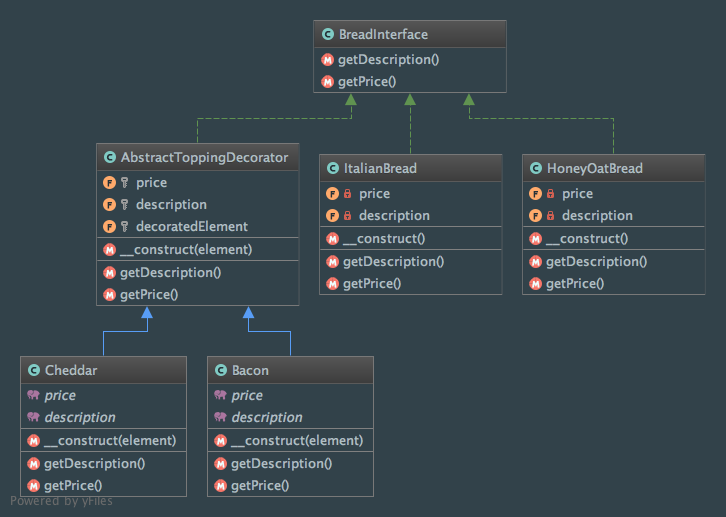

Decorator
=========

Intent
------
According to the Gang of Four, the Decorator pattern is a way to "attach additional responsibilities to an object
dynamically. Decorators provide a flexible alternative to subclassing for extending functionality."
(Design Patterns: Elements of Reusable Object-Oriented Software, 2013, p. 175).

Why would you want to find an alternative to subclassing ? Because subclassing is a **static mechanism**. This isn't
flexible and you won't be able to control how and when to add functionality to your object.

To illustrate it, I have decided to act like a fast food restaurant that sells submarine sandwiches (who said `Subway
<https://en.wikipedia.org/wiki/Subway_%28restaurant%29>`_?). First, choose a bread type (italian bread, honey-oat
bred, etc.) then "decorate" it with some toppings (like bacon, cheddar, etc.) and finally get the price and
the description for your combination.

When to use it?
---------------
It's better to use the Decorator pattern when a large number of combinations are possible when developing your
application or a feature. In that case, subclassing is not appropriate because it will simply require you to write
lots of classes to support all the possible combinations.

Diagram
-------
Created using PhpStorm and yFiles.

Implementation
--------------
BreadInterface.php

.. literalinclude:: ../../../src/Structural/Decorator/BreadInterface.php
    :linenos:
    :language: php

HoneyOatBread.php

.. literalinclude:: ../../../src/Structural/Decorator/Bread/HoneyOatBread.php
    :linenos:
    :language: php

ItalianBread.php

.. literalinclude:: ../../../src/Structural/Decorator/Bread/ItalianBread.php
    :linenos:
    :language: php

AbstractToppingDecorator.php

.. literalinclude:: ../../../src/Structural/Decorator/AbstractToppingDecorator.php
    :linenos:
    :language: php

Bacon.php

.. literalinclude:: ../../../src/Structural/Decorator/Topping/Bacon.php
    :linenos:
    :language: php

Cheddar.php

.. literalinclude:: ../../../src/Structural/Decorator/Topping/Cheddar.php
    :linenos:
    :language: php

Tests
-----
DecoratorTest.php

.. literalinclude:: ../../../tests/Structural/Decorator/DecoratorTest.php
    :linenos:
    :language: php