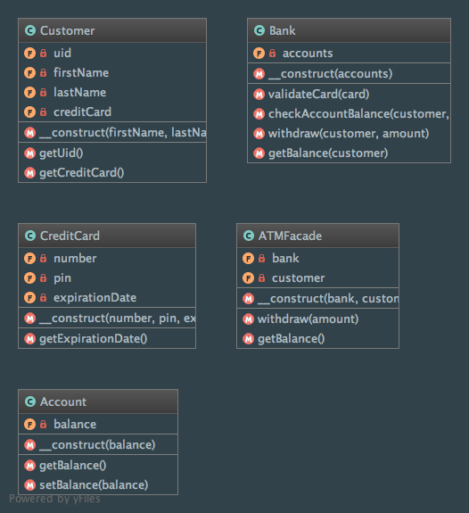

Facade
======

Intent
------
According to the Gang of Four, the Facade pattern is a way to "provide a unified interface to a set of interfaces in
a subsystem. Facade defines a higher-level interface that makes the subsystem easier to use"
(Design Patterns: Elements of Reusable Object-Oriented Software, 2013, p. 185).

When to use it?
---------------
The Facade pattern should be used when you face a complex subsystem and you only want to expose a simplified interface
to the clients (the trick is to hide internal complexity by providing a simple default view).

Clients needing more flexibility are still able to access subsystem classes and customize the behavior of the features.

Another use of the Facade pattern is decoupling source code between clients and concrete classes (implementations of
an abstraction).

Diagram
-------
Created using PhpStorm and yFiles.

Implementation
--------------
ATMFacade.php

.. literalinclude:: ../../src/Structural/Facade/ATMFacade.php
    :linenos:
    :language: php

Bank.php

.. literalinclude:: ../../src/Structural/Facade/Bank.php
    :linenos:
    :language: php

Account.php

.. literalinclude:: ../../src/Structural/Facade/Account.php
    :linenos:
    :language: php

Customer.php

.. literalinclude:: ../../src/Structural/Facade/Customer.php
    :linenos:
    :language: php

CreditCard.php

.. literalinclude:: ../../src/Structural/Facade/CreditCard.php
    :linenos:
    :language: php

Tests
-----
FacadeTest.php

.. literalinclude:: ../../tests/Structural/Facade/FacadeTest.php
    :linenos:
    :language: php