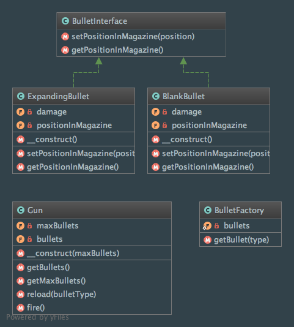

Flyweight
=========

Intent
------
According to the Gang of Four, the Flyweight pattern is a way to "use sharing to support large numbers of
fine-grained objects efficiently"
(Design Patterns: Elements of Reusable Object-Oriented Software, 2013, p. 195).

When to use it?
---------------
Flyweight pattern should be used when you have a large number of objects to deal with in you application! You have to
be aware that each Flyweight object must be divided into two parts to be able to use the pattern: the intrinsic
state (stored in the Flyweight, independent of the context) and the extrinsic state (dependent of the context, not
shareable).

Note that the pattern also allows to decrease objects' memory footprint and increase overall performance of the
application.

Diagram
-------
Created using PhpStorm and yFiles.

Implementation
--------------
BulletFactory.php

.. literalinclude:: ../../../src/Structural/Flyweight/BulletFactory.php
    :linenos:
    :language: php

BulletInterface.php

.. literalinclude:: ../../../src/Structural/Flyweight/BulletInterface.php
    :linenos:
    :language: php

BlankBullet.php

.. literalinclude:: ../../../src/Structural/Flyweight/Bullet/BlankBullet.php
    :linenos:
    :language: php

ExpandingBullet.php

.. literalinclude:: ../../../src/Structural/Flyweight/Bullet/ExpandingBullet.php
    :linenos:
    :language: php

Gun.php

.. literalinclude:: ../../../src/Structural/Flyweight/Gun.php
    :linenos:
    :language: php

Tests
-----
FlyweightTest.php

.. literalinclude:: ../../../tests/Structural/Flyweight/FlyweightTest.php
    :linenos:
    :language: php