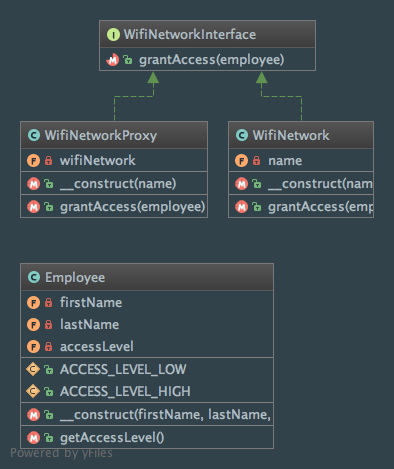

Proxy
=====

Intent
------
According to the Gang of Four, the Proxy pattern is a way to "provide a surrogate or placeholder for another object
to control access to it"
(Design Patterns: Elements of Reusable Object-Oriented Software, 2013, p. 207).

When to use it?
---------------
Proxy pattern should be used when it's useful to have a placeholder instead of another object (remote and/or resource
hungry actual object, access control, etc.). This has several benefits such as creating objects only on demand or
hiding the fact that objects are remote located.

Diagram
-------
Created using PhpStorm and yFiles.

Implementation
--------------
Employee.php

.. literalinclude:: ../../../src/Structural/Proxy/Employee.php
    :linenos:
    :language: php

WifiNetworkInterface.php

.. literalinclude:: ../../../src/Structural/Proxy/WifiNetworkInterface.php
    :linenos:
    :language: php

WifiNetwork.php

.. literalinclude:: ../../../src/Structural/Proxy/WifiNetwork.php
    :linenos:
    :language: php

WifiNetworkProxy.php

.. literalinclude:: ../../../src/Structural/Proxy/WifiNetworkProxy.php
    :linenos:
    :language: php

Tests
-----
ProxyTest.php

.. literalinclude:: ../../../tests/Structural/Proxy/ProxyTest.php
    :linenos:
    :language: php